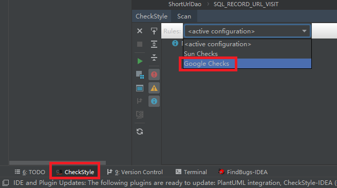

### 代码互查

##### 步骤1 看开发者署名

每个类的类注释中要编写开发者的名字及联系信息, 例如:

```java
/**
 * @author Steven Paul Jobs [eMail: jobs@apple.com]
 * @version 0.1 [1996/4/29]
 */
```

在 idea 中通过 settings --> file and code templates --> 右边选 Class --> 填入

```java
#if (${PACKAGE_NAME} && ${PACKAGE_NAME} != "")package ${PACKAGE_NAME};#end

/**
 * ${DESCRIPTION}
 * @author 涂鼎 [eMail: tuding27@gmail.com]
 * @version 0.1 [${DATE}]
 */
public class ${NAME} {
}
```

完成以上设置后, 在创建类的时候, idea 会自动加入署名信息.

除创建类时的署名外, 在修改他人的源码时, 需要在修改的位置上加上三个注释要素: who when what, 谁, 何时, 修改了什么


##### 步骤2 排版
可以首先通过 idea 的插件 checkStyle 来自动检查格式是否符合代码格式规范



确保没有严重格式违例.

缩进体现代码的层级关系, 对于阅读十分重要. 类/方法间合理的间隔空行, 可提升开发和源码阅读的效率. 需要注意清除多余的无意义的空白行


##### 步骤3 检查命名
命名包括包名, 类名, 方法名, 变量和常量的命名.

命名要求能清晰的表达所命名对象的作用和含义(自描述性). 可以但不推荐使用拼音. 常用术语要采用[字典](dict.docx)中的规范单词.

变量或常量的命名长度和其作用范围有关. public static 变量作用范围广, 因此需要特别清晰的描述, 有多长写多长. 反之, 一个if或for块中的申明变量可能只出现一两次, 因此可以从简, 甚至简化到只用一个字母.


##### 步骤4 检查日志

依次要检查:

- 是否写了日志
- 不允许 System.out.print 的存在
- 日志使用的级别是否合理
- 日志的措辞是否简明扼要

哪些地方需要写入日志?
 
1. 因程序运行导致系统状态发生改变的时候, 一定要日志. 例如: 增删改数据库;创建修改删除磁盘文件;改变共享内存状态等
2. 对于开发人员掌握程序, 特别是流程复杂的程序的运行状态时, 在关键节点上加入日志很有必要;
3. 项目上线后运维人员了解程序运行情况的关键节点, 有必要输出日志;

充分, 级别设置合理的日志有助于排错以及监视程序的运行状态.


##### 步骤5 是否存在 hardcode
正式上线后的项目是绝对不允许有 hardcode 存在的. 如果开发过程中临时采用 hardcode 也需要在其上用 //TODO 做上标记, 再在合适的时候改正.


### 代码评审

##### 重新检查"代码互查"中的所有检查项目;

##### 注释率
注释在一定程度可以帮助理解代码，提升可维护性。但需要注意不要加可有可无的注释，应追求代码自注释。

##### 平均函数代码行
反映函数的单一职责性。单一职责即功能内聚。行数越多，可能是函数承担了太多职责造成的，往往隐含故障就越多，构建和维护成本就越高

##### 平均函数复杂度
反映函数的复杂性。越复杂，函数隐含的故障就越多，构建和维护成本就越高。

##### 平均块深度
块深度是指被if/for/while等包围的嵌套层次。嵌套越多，逻辑越复杂，代码可读性越差，构建和维护成本就越高
