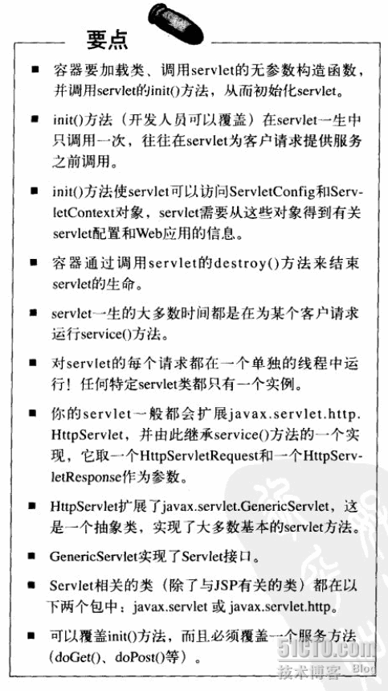

### ServletRequest 与 ServletResponse
 
请求和相应是Web交互最基本的模式，在Servlet中，分别用 HttpServletRequest 与 HttpServletResponse 来表示 Http 请求和响应。
这两个类均来自javax.servlet.http包，是J2EE Servlet与JSP规范的一部分，因此，谈及 HttpServletRequest 与 HttpServletResponse 的时候，其实都是和Servlet（包括JSP）有关的。与HTML、ASP、PHP是没有关系的，你也无法在HTML中使用它们。
 

 
#### 一 ServletRequest
 
代表一个 HTTP 请求，请求在内存中是一个对象，这个对象是一个容器，可以存放请求参数和属性。
 
1. 请求对象何时被创建，当通过URL访问一个JSP或者Servlet的时候，也就是当调用Servlet的service()、doPut()、doPost()、doXxx()方法时候的时候，执行Servlet的web服服务器就自动创建一个ServletRequest和ServletResponse的对象，传递给服务方法作为参数。
 
2. 请求对象由Servlet容器自动产生，这个对象中自动封装了请求中get和post方式提交的参数，以及请求容器中的属性值，还有http头等等。当Servlet或者JSP得到这个请求对象的时候，就知道这个请求时从哪里发出的，请求什么资源，带什么参数等等。
 
3. ServletRequest的层次结构

```
javax.servlet.ServletRequest 
  javax.servlet.http.HttpServletRequest
```

4. 通过请求对象，可以获得Session对象和客户端的Cookie。
 
5. 请求需要指定URL，浏览器根据URL生成HTTP请求并发送给服务器，请求的URL有一定的规范：


 
#### 二 ServletResponse
 
也是由容器自动创建的，代表Servlet对客户端请求的响应，响应的内容一般是HTML，而HTML仅仅是响应内容的一部分。
 
相应对象有以下功能：
1. 向客户端写入Cookie
2. 重写URL
3. 获取输出流对象，向客户端写入文本或者二进制数据
4. 设置响应客户端浏览器的字符编码类型
5. 设置客户端浏览器的MIME类型。

 
#### 三 GET与POST的并没有本质区别
 
表面上, get请求的参数参数在url里面，不安全，post请求的参数放在请求体中，安全


#### 四 MIME 类型


 
#### 五 要点

##### Http 重要知识点


##### Servlet 重要知识点



##### Servlet 输出的重要知识点

 

 
 

 

